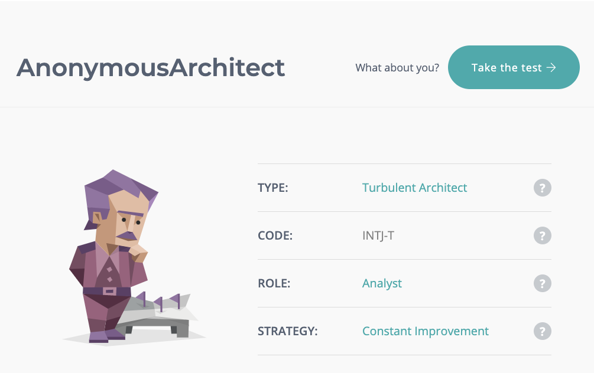

<html>
  

  <h1>
         Team Proflie
  </h1>
  

  <body>
  Input Text here 
  </body>
  
  <h2>
  <b> Personal Profiles </b>
  </h2> 

<body>
  
 
 <h4> <b> Edward </b> </h4> 

  

  My name is Edward Glush. Student number s3755136. My background involves a lifetime living in Melbourne, completing VCE and then moving towards a finance degree. I intend on completing my qualification with the Institute of Actuarial Studies and focusing on this for the years to come. 
  

  <h4> <b> James </b> </h4> 

  My name is James and I have worked in I.T. previously working in marketing for a 3D glasses-less tech company and often to keep in touch with them as I still have friends that work there. My interests have always been in computers and technology and keeping up with new hardware that comes out as I have a keen interest in building and modifying my desktop PC.
My hobbies include gaming on the computer, overclocking my PC, and simple things like watching sci-fi movies and fishing.

 
 <h4> <b> Despina </b> </h4> 

 

  

  <h4> <b> Jack </b> </h4> 

  Hello! My name is Jack or s3855707. I have been interested in Information technology ever since I could type on a keyboard, play on the first consoles and call on the first iPhone. All throughout high school I was building computers developing databases and studying analytics, most of this was made possible with various courses through school, one being year 8 – 10 IT. My interest for IT has only developed through the years and is continuing to grow further, thanks to this course.
  
  

</body>

  

  <h2> 
  Idea Jobs
  </h2>
  
  <body>
  Input text here
  </body>
  
  

  <h2>
  Tools
  </h2>
  
  

  
  <h3>
  Industry Data
  </h3>
  
  <body>
  
  </body>
  
  

  
  <h3>
  IT Work
  </h3>
    
   <body>
    
   </body>
  
  

  
  <h3>
  IT Technologies
  </h3>
  
  <body>
  
  </body>
  
  

  
</html>
